# Database Schema Diagram

This document provides a visual representation of the database schema for the application.

## Entity Relationship Diagram

```mermaid
erDiagram
    User ||--o{ Contact : owns
    User ||--o{ Interaction : creates
    User ||--o{ Tag : creates
    User ||--o{ Token : has
    Contact ||--o{ Interaction : has
    Contact }o--o{ Tag : tagged_with
    Contact ||--o{ ContactMethod : contains

    User {
        ObjectId _id PK
        string name
        string email UK
        string password
        string role "enum: user, admin"
        boolean isEmailVerified
        datetime createdAt
        datetime updatedAt
    }

    Contact {
        ObjectId _id PK
        ObjectId owner FK
        string firstName
        string lastName
        string organization
        string jobTitle
        string status "enum: lead, active, inactive, warm, cold"
        datetime lastContacted
        datetime birthday
        array tags "references Tag"
        datetime createdAt
        datetime updatedAt
    }

    ContactMethod {
        ObjectId _id PK
        string type "enum: email, phone, linkedin, telegram, whatsapp"
        string value
        string label "enum: personal, work, other"
        boolean isPrimary
    }

    Interaction {
        ObjectId _id PK
        ObjectId contact FK
        ObjectId user FK
        string type "enum: call, email, meeting, note, event"
        string summary
        string description
        datetime occurredAt
        datetime createdAt
        datetime updatedAt
    }

    Tag {
        ObjectId _id PK
        string name
        string color "hex color code"
        ObjectId user FK
        datetime createdAt
        datetime updatedAt
    }

    Token {
        ObjectId _id PK
        string token "indexed"
        ObjectId user FK
        string type "enum: refresh, resetPassword, verifyEmail"
        datetime expires
        boolean blacklisted
        datetime createdAt
        datetime updatedAt
    }
```

## Schema Overview

### Core Entities

#### User
- Main authentication and authorization entity
- Has roles: `user`, `admin`
- Email must be unique and validated
- Password is hashed before storage

#### Contact
- Represents a person or organization in the contact management system
- Each contact is owned by a User
- Supports multiple contact methods (email, phone, social media)
- Can be tagged with multiple Tags for organization
- Tracks status: `lead`, `active`, `inactive`, `warm`, `cold`

#### ContactMethod (Embedded)
- Embedded document within Contact
- Supports multiple contact types: email, phone, linkedin, telegram, whatsapp
- Can be labeled as personal, work, or other
- One can be marked as primary

#### Interaction
- Tracks all interactions between users and contacts
- Types include: call, email, meeting, note, event
- Linked to both the Contact and the User who created it
- Includes timestamp of when the interaction occurred

#### Tag
- User-specific tags for organizing contacts
- Each user has their own set of tags (enforced by unique index on name + user)
- Supports custom colors (hex code)

#### Token
- Manages authentication tokens
- Types: refresh tokens, password reset tokens, email verification tokens
- Can be blacklisted to invalidate
- Automatically expires based on expiration date

## Indexes

- **User**: email (unique)
- **Token**: token (indexed for fast lookup)
- **Tag**: compound index on (name, user) for uniqueness per user
- **Interaction**: compound indexes on (contact, occurredAt) and (user, occurredAt) for efficient timeline queries

## Relationships

- **One-to-Many**: 
  - User → Contacts
  - User → Interactions
  - User → Tags
  - User → Tokens
  - Contact → Interactions
  - Contact → ContactMethods

- **Many-to-Many**:
  - Contacts ↔ Tags (one contact can have many tags, one tag can apply to many contacts)
