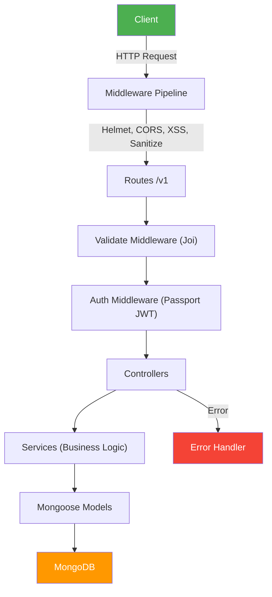
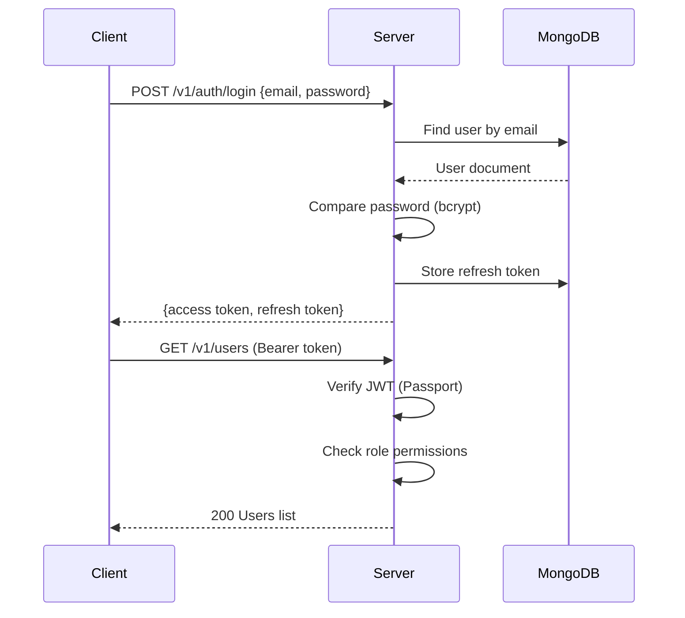
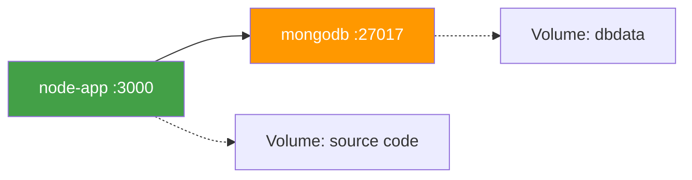

# SDN302 — RESTful API Server

> A production-ready Node.js REST API built with **Express**, **MongoDB/Mongoose**, and **JWT Authentication**.

---

## Table of Contents

- [Quick Start](#quick-start)
- [Features](#features)
- [Architecture Overview](#architecture-overview)
- [Project Structure](#project-structure)
- [Environment Variables](#environment-variables)
- [API Reference](#api-reference)
- [Data Models](#data-models)
- [Authentication & Authorization](#authentication--authorization)
- [Middleware Pipeline](#middleware-pipeline)
- [Error Handling](#error-handling)
- [Validation](#validation)
- [Logging](#logging)
- [Testing](#testing)
- [Docker Deployment](#docker-deployment)
- [Scripts & Commands](#scripts--commands)
- [Contributing](#contributing)

---

## Quick Start

```bash
# 1. Install dependencies
yarn install

# 2. Configure environment
cp .env.example .env
# Edit .env with your MongoDB URL, JWT secret, etc.

# 3. Run in development mode
yarn dev

# Server starts at http://localhost:3000
# API docs at http://localhost:3000/v1/docs
```

---

## Features

| Category | Details |
|---|---|
| **Database** | MongoDB with Mongoose ODM, custom plugins (toJSON, paginate) |
| **Auth** | JWT (access + refresh tokens) via Passport.js |
| **Validation** | Request data validation with Joi schemas |
| **Security** | Helmet, XSS protection, Mongo sanitization, CORS, rate limiting |
| **Docs** | Auto-generated Swagger/OpenAPI documentation |
| **Testing** | Jest (unit + integration), Supertest, Faker, node-mocks-http |
| **DevOps** | Docker + Docker Compose, PM2 process management, Travis CI |
| **Quality** | ESLint (Airbnb), Prettier, Husky + lint-staged git hooks |

---

## Architecture Overview



The application follows a **layered architecture pattern**:

| Layer | Responsibility | Location |
|---|---|---|
| **Routes** | Define endpoints, attach middleware | `src/routes/v1/` |
| **Controllers** | Handle HTTP req/res, delegate to services | `src/controllers/` |
| **Services** | Business logic, orchestration | `src/services/` |
| **Models** | Data schema, DB interactions | `src/models/` |
| **Middlewares** | Cross-cutting concerns (auth, validation, errors) | `src/middlewares/` |
| **Config** | Environment variables, external service setup | `src/config/` |

---

## Project Structure

```
├── src/
│   ├── app.js                    # Express app initialization
│   ├── index.js                  # Entry point (connects to DB, starts server)
│   ├── config/
│   │   ├── config.js             # Env vars validation & export
│   │   ├── logger.js             # Winston logger setup
│   │   ├── morgan.js             # HTTP request logging
│   │   ├── passport.js           # JWT strategy configuration
│   │   ├── roles.js              # Role-based permissions map
│   │   └── tokens.js             # Token type constants
│   ├── controllers/
│   │   ├── auth.controller.js    # Register, login, refresh, password reset
│   │   └── user.controller.js    # CRUD operations for users
│   ├── docs/
│   │   ├── swaggerDef.js         # Swagger definition
│   │   └── components.yml        # Reusable Swagger components
│   ├── middlewares/
│   │   ├── auth.js               # JWT authentication + role authorization
│   │   ├── error.js              # Error converter + handler
│   │   ├── rateLimiter.js        # Rate limiting for auth routes
│   │   └── validate.js           # Joi schema validation
│   ├── models/
│   │   ├── user.model.js         # User schema (name, email, password, role)
│   │   ├── token.model.js        # Token schema (refresh, reset, verify)
│   │   └── plugins/
│   │       ├── toJSON.plugin.js  # Sanitize JSON output
│   │       └── paginate.plugin.js# Query pagination
│   ├── routes/v1/
│   │   ├── index.js              # Route aggregator
│   │   ├── auth.route.js         # Auth endpoints
│   │   ├── user.route.js         # User CRUD endpoints
│   │   └── docs.route.js         # Swagger UI route
│   ├── services/
│   │   ├── auth.service.js       # Auth business logic
│   │   ├── user.service.js       # User CRUD logic
│   │   ├── token.service.js      # JWT generation & verification
│   │   └── email.service.js      # Email sending via Nodemailer
│   ├── utils/
│   │   ├── ApiError.js           # Custom error class with status code
│   │   ├── catchAsync.js         # Async error wrapper for controllers
│   │   └── pick.js               # Object key picker utility
│   └── validations/
│       ├── auth.validation.js    # Auth request schemas
│       ├── user.validation.js    # User request schemas
│       └── custom.validation.js  # Reusable custom validators (objectId, password)
├── tests/
│   ├── fixtures/                 # Test data factories
│   ├── integration/              # API integration tests
│   ├── unit/                     # Unit tests
│   └── utils/                    # Test utilities
├── Dockerfile                    # Node.js Alpine container
├── docker-compose.yml            # App + MongoDB orchestration
├── ecosystem.config.json         # PM2 production config
├── jest.config.js                # Jest test configuration
└── .env.example                  # Environment variable template
```

---

## Environment Variables

Configure these in a `.env` file at the project root:

| Variable | Description | Default | Required |
|---|---|---|---|
| `PORT` | Server port | `3000` | No |
| `MONGODB_URL` | MongoDB connection URI | — | **Yes** |
| `JWT_SECRET` | Secret key for signing JWTs | — | **Yes** |
| `JWT_ACCESS_EXPIRATION_MINUTES` | Access token TTL (minutes) | `30` | No |
| `JWT_REFRESH_EXPIRATION_DAYS` | Refresh token TTL (days) | `30` | No |
| `JWT_RESET_PASSWORD_EXPIRATION_MINUTES` | Password reset token TTL | `10` | No |
| `JWT_VERIFY_EMAIL_EXPIRATION_MINUTES` | Email verification token TTL | `10` | No |
| `SMTP_HOST` | Email server hostname | — | No |
| `SMTP_PORT` | Email server port | `587` | No |
| `SMTP_USERNAME` | Email server username | — | No |
| `SMTP_PASSWORD` | Email server password | — | No |
| `EMAIL_FROM` | Sender email address | — | No |

> [!IMPORTANT]
> Never commit the `.env` file. Use `.env.example` as a template.

---

## API Reference

**Base URL:** `http://localhost:3000/v1`  
**Interactive Docs:** `http://localhost:3000/v1/docs` (Swagger UI)

### Auth Routes

| Method | Endpoint | Description | Auth |
|---|---|---|---|
| `POST` | `/auth/register` | Register a new user | ✗ |
| `POST` | `/auth/login` | Login with email & password | ✗ |
| `POST` | `/auth/refresh-tokens` | Get new access + refresh token pair | ✗ |
| `POST` | `/auth/forgot-password` | Send password reset email | ✗ |
| `POST` | `/auth/reset-password` | Reset password with token | ✗ |
| `POST` | `/auth/send-verification-email` | Send email verification link | ✓ |
| `POST` | `/auth/verify-email` | Verify email with token | ✗ |

### User Routes

| Method | Endpoint | Description | Auth | Permission |
|---|---|---|---|---|
| `POST` | `/users` | Create a user | ✓ | `manageUsers` |
| `GET` | `/users` | List all users (paginated) | ✓ | `getUsers` |
| `GET` | `/users/:userId` | Get a specific user | ✓ | `getUsers` |
| `PATCH` | `/users/:userId` | Update a user | ✓ | `manageUsers` |
| `DELETE` | `/users/:userId` | Delete a user | ✓ | `manageUsers` |

### Response Format

**Success:**
```json
{
  "id": "60c72b2f4f1a4e001f8e4dab",
  "name": "John Doe",
  "email": "john@example.com",
  "role": "user"
}
```

**Paginated:**
```json
{
  "results": [],
  "page": 1,
  "limit": 10,
  "totalPages": 5,
  "totalResults": 48
}
```

**Error:**
```json
{
  "code": 404,
  "message": "User not found"
}
```

---

## Data Models

### User

| Field | Type | Constraints |
|---|---|---|
| `name` | String | Required, trimmed |
| `email` | String | Required, unique, lowercase, validated |
| `password` | String | Required, min 8 chars, must contain letter + number, **private** (hidden in JSON) |
| `role` | String | `user` (default) or `admin` |
| `isEmailVerified` | Boolean | Default: `false` |
| `createdAt` | Date | Auto-generated |
| `updatedAt` | Date | Auto-generated |

**Static Methods:** `isEmailTaken(email, excludeUserId)`  
**Instance Methods:** `isPasswordMatch(password)`  
**Hooks:** Pre-save password hashing (bcrypt, salt rounds: 8)

### Token

| Field | Type | Constraints |
|---|---|---|
| `token` | String | Required, indexed |
| `user` | ObjectId | Ref → `User`, required |
| `type` | String | `refresh`, `resetPassword`, or `verifyEmail` |
| `expires` | Date | Required |
| `blacklisted` | Boolean | Default: `false` |

---

## Authentication & Authorization

### Flow



### Roles & Permissions

| Role | Permissions |
|---|---|
| `user` | *(no special permissions)* |
| `admin` | `getUsers`, `manageUsers` |

### Token Strategy

- **Access Token:** Short-lived (30 min), sent in `Authorization: Bearer <token>` header
- **Refresh Token:** Long-lived (30 days), used to obtain new access tokens
- **Reset Password Token:** 10 min TTL, sent via email
- **Verify Email Token:** 10 min TTL, sent via email

---

## Middleware Pipeline

Requests flow through middleware in this order:

```
Morgan (logging)
  → Helmet (security headers)
    → JSON Parser
      → URL-encoded Parser
        → XSS Clean
          → Mongo Sanitize
            → Compression (gzip)
              → CORS
                → Passport Init (JWT)
                  → Rate Limiter (auth routes, production only)
                    → Routes (/v1)
                      → 404 Handler
                        → Error Converter
                          → Error Handler
```

---

## Error Handling

### Custom Error Class

```javascript
const ApiError = require('./utils/ApiError');
throw new ApiError(httpStatus.NOT_FOUND, 'User not found');
```

### Async Wrapper

```javascript
const catchAsync = require('./utils/catchAsync');
const controller = catchAsync(async (req, res) => { /* ... */ });
```

All errors flow through centralized `errorConverter` → `errorHandler` middleware. In **development** mode, stack traces are included in responses.

---

## Validation

Request validation uses **Joi** schemas applied via the `validate` middleware:

```javascript
router.post('/users', validate(userValidation.createUser), userController.createUser);
```

Schemas are defined in `src/validations/` and include custom validators for:
- **ObjectId** format validation
- **Password** complexity (min 8 chars, at least 1 letter and 1 number)

---

## Logging

| Logger | Library | Purpose |
|---|---|---|
| **Application** | Winston | `error`, `warn`, `info`, `http`, `verbose`, `debug` levels |
| **HTTP Requests** | Morgan | Request URL, status code, response time |

- **Development:** All log levels printed to console
- **Production:** Only `info`, `warn`, `error` — PM2 handles log file storage

---

## Testing

```bash
yarn test               # Run all tests
yarn test:watch         # Watch mode
yarn coverage           # With coverage report
```

### Test Structure

```
tests/
├── fixtures/           # User & token factories
├── integration/        # Full HTTP request tests (Supertest)
├── unit/               # Isolated function tests
└── utils/              # Setup & helper utilities
```

Tests use **Jest** with **Supertest** for HTTP assertions and **Faker** for test data generation.

---

## Docker Deployment

### Quick Run

```bash
# Development
yarn docker:dev

# Production
yarn docker:prod

# Tests
yarn docker:test
```

### Architecture



- **Node.js Alpine** image for minimal footprint
- **MongoDB 4.2** with persistent volume (`dbdata`)
- Bridge network for internal service communication
- PM2 in production mode (`ecosystem.config.json`)

---

## Scripts & Commands

| Command | Description |
|---|---|
| `yarn dev` | Start dev server with nodemon (auto-reload) |
| `yarn start` | Start production server with PM2 |
| `yarn seed` | Clear database and insert sample users, contacts, tags, and interactions |
| `yarn test` | Run all tests |
| `yarn test:watch` | Run tests in watch mode |
| `yarn coverage` | Generate test coverage report |
| `yarn lint` | Run ESLint |
| `yarn lint:fix` | Auto-fix ESLint errors |
| `yarn prettier` | Check code formatting |
| `yarn prettier:fix` | Auto-fix formatting |
| `yarn docker:dev` | Run in Docker (development) |
| `yarn docker:prod` | Run in Docker (production) |
| `yarn docker:test` | Run tests in Docker |

---

## Contributing

1. Fork the repository
2. Create a feature branch (`git checkout -b feature/my-feature`)
3. Commit changes (`git commit -m 'Add my feature'`)
4. Push to branch (`git push origin feature/my-feature`)
5. Open a Pull Request

See [CONTRIBUTING.md](../CONTRIBUTING.md) for detailed guidelines.

---

## License

[MIT](../LICENSE)
